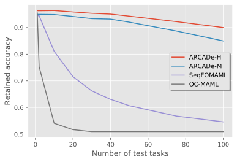

## ARCADe: A Rapid Continual Anomaly Detector (ICPR 2020)

This code repository contains the implementation of the ARCADe algorithm from the paper 
"ARCADe: A Rapid Continual Anomaly Detector" accepted at ICPR 2020 (https://arxiv.org/abs/2008.04042).

Bibtex:
```
@article{frikha2020arcade,
  title={ARCADe: A Rapid Continual Anomaly Detector},
  author={Frikha, Ahmed and Krompa{\ss}, Denis and Tresp, Volker},
  journal={arXiv preprint arXiv:2008.04042},
  year={2020}
}
```

The code provided in this repository works with three different datasets, and can easily be extended to further datasets. 
To run the code on a dataset, the corresponding configuration file has to be used. For example, for Omniglot run:
```
python arcade_main.py -config_file=config_OMN_ARCADe_H_BN_K10_seq10.json
```

To download the raw data for Omniglot and miniImageNet, follow instructions in https://github.com/spiglerg/pyMeta. 
We downloaded CIFAR-FS from https://github.com/kjunelee/MetaOptNet. 

The following Figure illustrates some of our results on the Omniglot dataset. 
ARCADe enables learning up to 100 unseen anomaly detection tasks, i.e. using only examples from their respective normal class, with minimal forgetting (~ 4% accuracy).
<div style="text-align:center">

</div>
